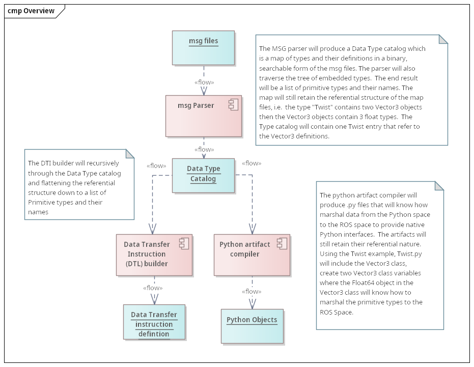

# Problem Statement
While developing the Micropython intergration for MicroROS, it became apparetn that there was a need to provide native python interfaces for the .msg files in ROS as it would be too cumborsome to write C code that would produce a C/C++ class that would interface ROS Types to Micropython. This would require C Coding and a recompile of the ROS image which may beyond the scope of the Python programmer and may also cause problematic drift between images loaded on  various devices where a embedded type may be missing requiring that all devices be upgraded to the latest image.

# Propose Solution
Create a smallfoot print Parser that will be able to a memory based Data Transfer Instruction structure that provides information that a generic data marshaling engine. This will be coupled with a template based python class generstor to allow the Micropython code to selectivly used all existing .msg files or create new msg types at runtime without the need for a recompile of the device image.

As an example, take the Twist msg which consists of 2 Vector3's which in them selves at a type of floats.  

The parser would build a Data Transfer instruction list, where the DTEngine will allocate memory for the data type, then copy data to/from by using a void pointer that will copy data to structure for the native types. Continuing with the Twist example, Twist defined two types of Vector3, which eact consist of 3 Float64, a native type. 
**Example DTI definition for Twist**

* 1.0 Vector3 Linear
  * 1.1 Float64 x
  * 1.2 Float64 y
  * 1.3 Float64 z
* 2.0 Vector3 Angular
  * 2.1 Float64 x
  * 2.2 Float64 y
  * 2.3 Float64 z

Would result in a memory allocation of Float64 x 6, then a routine that will walk thru the primitive types and perform

ptr = copyToRos(ptr, Float64)
where the return value will be incremented by sizeof(float64) on each call. 

Data flow from ROS to Python will be defined when registering the listener for a message. 
the Python code 

 > **registerMsgListener("cmd_vel", Twist)** 
 
 would instruct the Data Transfer to create a Twist python object and populate the named values using the DTI definiton on recipt of the message. 

**Here is an overview of the data flow to produce the DTI definitions and artifacts**

# Real world examples.
* [The test folder includes an executable that will run in a Linux env or Docker container defined here](test)

* [The output folder contains the examples of the output produced for the Python artifaces and a DTI definition](test/output/)

# Alternatives to this approach
This POC code could be ported back to Python usign ANTLR and added as an extension to [RShell](https://github.com/dhylands/rshell) to parse, produce output files and directly load the final output to the device. This could be further extended to be used as an extension to [Visual Code Studio](https://code.visualstudio.com/docs/languages/python) or [Thonny](https://github.com/thonny/thonny/wiki/Plugins) 

**Notes:**
* Original grammar borrowed from: https://github.com/jr-robotics/RobSharper.Ros.MessageParser

* Convered to Bison/Flex from Antlr due to runtime footprint of Antlr in a microcontroller. 

* This is  a module that will support runtime IDL compilation along with the ability to marshal data between the MicroROS layer and MicroPython.

My approach is to create a ROS .msg parser that will compile the ROS message definition into a condensed list of data movement instructions supportingthe native data types and provide methods like toC and toPython.  

I like Antlr but when looking at it for the prospective of a limited memory micro-controller Antlr's runtime library is huge. I haven't worked with Bison/Flex in many years but I like it in that it sacrifices speed for memory efficiency and since I will either pre-compile or cache the instruction list, I am not too concerned with parser speed.  
